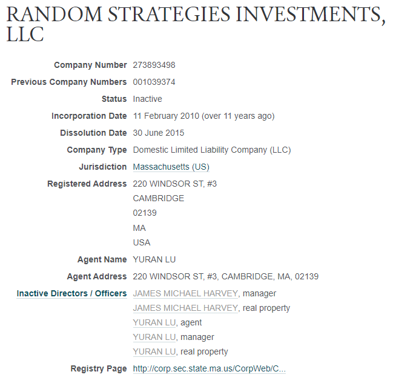

background-image: url(https://www.onlinecasinoreports.com/images/cashwinfall.jpg)
background-size: contain

```{r setup, include=FALSE}
library(tidyverse)
library(kableExtra)
library(gtools)

options(htmltools.dir.version = FALSE)
knitr::opts_chunk$set(echo = FALSE)
```

---

## Comment ça fonctionne la loterie?

- Nous nous intéressons aux loteries de type $k/n$.

- C'est-à-dire que $k$ numéros sont tirés (sans remise) à partir d'un ensemble de $n$ numéros (les $n$ premiers entiers excluant le zéro).

- Les $k$ numéros tirés sont ensuite placés en ordre croissant, ce qui implique que l'acheteur n'a pas à choisir ses numéros dans l'ordre.

- Le gros lot est gagné si les $k$ numéros choisis par l'acheteur sont ceux pigés.

- D'autres lots peuvent être gagnés en ayant choisi $l$ numéros parmi les $k$ pigés, avec $l<k$.

---
class: center, middle

## Cash WinFall, le lundi 23 janvier 2012

<iframe width="560" height="315" src="https://www.youtube.com/embed/Y35uQ7b45qs" title="YouTube video player" frameborder="0" allow="accelerometer; autoplay; clipboard-write; encrypted-media; gyroscope; picture-in-picture" allowfullscreen></iframe>

---

## Un peu d'histoire

- **CASH WinFall** est une loterie de l'état du Massachusets qui a remplacé la loterie **Mass Millions** le 9 septembre 2004.

- La première pige s'est déroulée le 13 septembre de la même année. La dernière pige a eue lieu le 26 janvier 2012.

- C'est une loterie du type 6/46.

- Le prix d'un billet était de 2$ US.

- Le gros lot débutait toujours à 500 000$ US.

- Pour gagner, les possibilités étaient:

    - Les 6 numéros
    - 5 numéros sur 6
    - 4 numéros sur 6
    - 3 numéros sur 6
    - 2 numéros sur 6

---
class: inverse, center, middle

# Un peu de probabilités

---

## Les probabilités

- La probabilité d'un certain événement $A$, notée $P(A)$, associe une valeur entre 0 et 1 que l'événement se réalise.

- Lorsque $P(A)=1$, l'événement est dit presque sûr (ou quasi certain), c'est-à-dire qu'il a « toutes les chances » de se réaliser. 

- À l'inverse si $P(A)=0$, $A$ est dit négligeable (ou quasi impossible), c'est-à-dire qu'il a une chance nulle de se réaliser.

- Lorsque le nombre de résultats possibles de l'expérience est fini et que ces résultats sont équiprobables, la probabilité de $A$ est obtenue par : $$ P(A)=\dfrac{\text{nombre de cas où $A$ se réalise}}{\text{nombre de cas possibles}} $$

---

## Le lancer de deux dés à six faces

- On lance deux dés non biaisé à six faces.

- On calcule la somme des deux dés.

- Quelle est la probabilité d'obtenir 7?

---

```{tikz,tikz-two-dice,fig.align="center",cache=TRUE,echo=FALSE}
\newcommand{\dice}[3]{
\begin{tikzpicture}[scale=#3]
	\draw[rounded corners=1,#2,thick] (0,0) rectangle (1,1);
	\ifnum#1<7% "standard die"
  	\ifodd#1
    	\fill[#2] (0.5,0.5) circle(2.5pt);% 1,3,5,7,9
  	\fi
  	\ifnum#1>1
    	\fill[#2] (0.2,0.2) circle(2.5pt);% 2
    	\fill[#2] (0.8,0.8) circle(2.5pt);% 3
    	\ifnum#1>3
      		\fill[#2] (0.2,0.8) circle(2.5pt);% 4
      		\fill[#2] (0.8,0.2) circle(2.5pt);% 5
      	\ifnum#1>5
        	\fill[#2] (0.8,0.5) circle(2.5pt);% 5
        	\fill[#2] (0.2,0.5) circle(2.5pt);% 6
        \fi
      \fi
    \fi
  \fi
\end{tikzpicture}
}
\begin{tikzpicture}[scale=0.75]

\foreach \i in {1,2,3,4,5,6}{
  \node[above] at (\i,6.5) {\dice{\i}{red}{0.5}};
  \node[left] at (0.5,7-\i) {\dice{\i}{blue}{0.5}};
  \foreach[evaluate={\k=int(\i+\j)}] \j in {1,2,3,4,5,6}{
      \node at (\i,7-\j) {\k};
  }
}

\end{tikzpicture}
```

---

```{tikz,tikz-two-dice-red,fig.align="center",cache=TRUE,echo=FALSE}
\newcommand{\dice}[3]{
\begin{tikzpicture}[scale=#3]
	\draw[rounded corners=1,#2,thick] (0,0) rectangle (1,1);
	\ifnum#1<7% "standard die"
  	\ifodd#1
    	\fill[#2] (0.5,0.5) circle(2.5pt);% 1,3,5,7,9
  	\fi
  	\ifnum#1>1
    	\fill[#2] (0.2,0.2) circle(2.5pt);% 2
    	\fill[#2] (0.8,0.8) circle(2.5pt);% 3
    	\ifnum#1>3
      		\fill[#2] (0.2,0.8) circle(2.5pt);% 4
      		\fill[#2] (0.8,0.2) circle(2.5pt);% 5
      	\ifnum#1>5
        	\fill[#2] (0.8,0.5) circle(2.5pt);% 5
        	\fill[#2] (0.2,0.5) circle(2.5pt);% 6
        \fi
      \fi
    \fi
  \fi
\end{tikzpicture}
}
\begin{tikzpicture}[scale=0.75]

\foreach \i in {1,2,3,4,5,6}{
  \node[above] at (\i,6.5) {\dice{\i}{red}{0.5}};
  \node[left] at (0.5,7-\i) {\dice{\i}{blue}{0.5}};
  \foreach[evaluate={\k=int(\i+\j)}] \j in {1,2,3,4,5,6}{
      \ifnum\k=7{\node[text=red] at (\i,7-\j) {\large \k};}
      \else{\node at (\i,7-\j) {\k};}
      \fi
  }
}

\end{tikzpicture}
```
---

## Le lancer de deux dés à six faces

- On lance deux dés non biaisé à six faces.

- On calcule la somme des deux dés.

- Quelle est la probabilité d'obtenir 7?

$$P(\text{obtenir une somme de 7})=\frac{6}{36}=\frac{1}{6}$$

---

## Les combinaisons

- En mathématiques, une combinaison est une sélection d'objets choisis parmi une collection, de telle manière à ce que l'ordre de sélection n'a pas d'importance.

- Plus formellement, une $k$-combinaison d'un ensemble $S$ est un sous-ensemble de $k$ éléments distincts de $S$. Si l'ensemble possède $n$ éléments, le nombre de $k$-combinaisons est égal au coefficient binomial.

- Le coefficient binomial est noté $\binom{n}{k}=C_k^n=\dfrac{n!}{k!(n-k)!}$.

---

## Une combinaison de 3 parmi 5

$$\binom{5}{3}=C_3^5=\dfrac{5!}{3!(5-3)!}=10$$

```{tikz,tikz-coefficient-binomial,fig.align="center",cache=TRUE,echo=FALSE}
\usetikzlibrary{calc}
\begin{tikzpicture}[scale=0.25]

\foreach \i in {1,2,...,5}{
	\node[above] at ($(\i,0)+(0.5,1)$) {\small\i};
}

\foreach \j [evaluate={\k=int(-1*\j+1)}] in {0,-1,...,-9}{
	\node[left,text=lightgray] at ($(1,\j)+(0,0.5)$) {\small\k};
}


\foreach \j in {0,-1,...,-9}{
	\foreach \i in {1,2,...,5}{
		\draw[thick] (\i,\j) rectangle++ (1,1);
	}
}

\foreach \i/\j/\k/\h in {
	1/2/3/0,
	1/2/4/-1,
	1/2/5/-2,
	1/3/4/-3,
	1/3/5/-4,
	1/4/5/-5,
	2/3/4/-6,
	2/3/5/-7,
	2/4/5/-8,
	3/4/5/-9
}{
	\draw[thick,fill=red] (\i,\h) rectangle++ (1,1);
	\draw[thick,fill=red] (\j,\h) rectangle++ (1,1);
	\draw[thick,fill=red] (\k,\h) rectangle++ (1,1);
}

\begin{scope}[xshift=6cm]

\foreach \j in {0,-1,...,-9}{
	\foreach \i in {1,2,3}{
		\draw[thick] (\i,\j) rectangle++ (1,1);
	}
}

\foreach \i/\j/\k/\h in {
	1/2/3/0,
	1/2/4/-1,
	1/2/5/-2,
	1/3/4/-3,
	1/3/5/-4,
	1/4/5/-5,
	2/3/4/-6,
	2/3/5/-7,
	2/4/5/-8,
	3/4/5/-9
}{
	\node at ($(1,\h)+(0.5,0.5)$) {\small\i};
	\node at ($(2,\h)+(0.5,0.5)$) {\small\j};
	\node at ($(3,\h)+(0.5,0.5)$) {\small\k};
}

\end{scope}

\end{tikzpicture}
```

---

## L'espérance mathématique

- En théorie des probabilités, l'espérance mathématique d'une variable aléatoire réelle est, intuitivement, la valeur que l'on s'attend à trouver, en moyenne, si l'on répète un grand nombre de fois la même expérience aléatoire. 

- Elle se note $E(X)$.

- Elle correspond à une moyenne pondérée des valeurs que peut prendre cette variable. 

- Dans le cas où celle-ci prend un nombre fini de valeurs, il s'agit d'une moyenne pondérée par les probabilités d'apparition de chaque valeur.

- Si la variable X prend les valeurs $x_1$, $x_2$, ..., $x_n$ avec les probabilités $p_1$, $p_2$, ..., $p_n$, l'espérance de X est définie comme: $$E(X)=x_1p_1+x_2p_2+\ldots+x_np_n$$

---

## Une fausse loterie

- Supposons que le billet coûte 2$.

- Vous avez une chance sur 200 de gagner 300$.

- Si vous jouez 1 000 fois, vous allez probablement gagner 5 fois, vous devriez gagner 1 500$, soit 1,50$ par billet.

--

- **Mais le billet coûte 2$!**

--

| Résultat          | Probabilité                       | Prix           |
|-------------------|:---------------------------------:|:--------------:|
| Le gros lot       | $\frac{1}{200}$                   | 300$           |
| Rien              | $\frac{199}{200}$                 | 0$             |

$$ \dfrac{300\$\times 1}{200}+\dfrac{0\$\times 199}{200} = 1,50\$ $$

- Puisque le billet coûte 2$, on perd donc 0,50$ à chaque achat de billet.

---

## Cash WinFall : les probabilités

- Les 6 numéros: $\dfrac{\binom{6}{6}}{\binom{46}{6}}= \dfrac{1}{9\ 366\ 819}$

- 5 numéros sur 6: $\dfrac{\binom{6}{5}\binom{40}{1}}{\binom{46}{6}}= \dfrac{240}{9\ 366\ 819} \approx \dfrac{1}{39\ 028,41}$

- 4 numéros sur 6: $\dfrac{\binom{6}{4}\binom{40}{2}}{\binom{46}{6}}= \dfrac{11\ 700}{9\ 366\ 819} \approx \dfrac{1}{800,58}$

- 3 numéros sur 6: $\dfrac{\binom{6}{3}\binom{40}{3}}{\binom{46}{6}}= \dfrac{197\ 600}{9\ 366\ 819} \approx \dfrac{1}{47,40}$

- 2 numéros sur 6: $\dfrac{\binom{6}{2}\binom{40}{4}}{\binom{46}{6}}= \dfrac{1\ 370\ 850}{9\ 366\ 819} \approx \dfrac{1}{6,83}$

---

## Cash WinFall

| Nombre de numéros | Probabilité                       | Prix           |
|-------------------|-----------------------------------|----------------|
| Les 6 numéros     | $\frac{1}{9\ 366\ 819}$           | Variable       |
| 5 numéros sur 6   | $\frac{240}{9\ 366\ 819}$         | 4 000$         |
| 4 numéros sur 6   | $\frac{11\ 700}{9\ 366\ 819}$     | 150$           |
| 3 numéros sur 6   | $\frac{197\ 600}{9\ 366\ 819}$    | 5$             |
| 2 numéros sur 6   | $\frac{1\ 370\ 850}{9\ 366\ 819}$ | Billet gratuit |

$$
\begin{align*}
& \dfrac{1\ 000\ 000\$}{9\ 366\ 819}+\dfrac{4\ 000\$ \times 240}{9\ 366\ 819}+\dfrac{150\$\times 11\ 700}{9\ 366\ 819}+\dfrac{5\$ \times 197\ 600}{9\ 366\ 819}+\\
& \qquad \qquad \qquad +\dfrac{2\$ \times 1\ 370\ 850}{9\ 366\ 819}\approx 0,7948\$
\end{align*}
$$

--

.center[
# Environ 0,80$, on perd donc 1,20$ par billet
]

---

class:inverse, center, middle

# Pourquoi parler de CashWinFall?

---

## Le "Roll-Down"

- Le gros lot débutait à 500 000$.

- Lorsque le gros lot n'était pas gagné, celui-ci était ajouté au gros lot suivant.

- Le gros lot était par contre d'un maximum de 2 000 000$.

- Si le gros lot atteignait 2 000 000$ et que personne ne le gagnait, *une partie de l'argent du gros lot était redistribué aux lots de moindre valeur*.

---

## Le "Roll-Down" du 8 février 2010

| Nombre de numéros | Probabilité                       | Prix habituel  | Prix "roll-down" |
|-------------------|-----------------------------------|----------------|------------------|
| Les 6 numéros     | $\frac{1}{9\ 366\ 819}$           | Variable       | Pas gagné        |
| 5 numéros sur 6   | $\frac{240}{9\ 366\ 819}$         | 4 000$         | 22 096$          |
| 4 numéros sur 6   | $\frac{11\ 700}{9\ 366\ 819}$     | 150$           | 807,52$          |
| 3 numéros sur 6   | $\frac{197\ 600}{9\ 366\ 819}$    | 5$             | 26,85$           |
| 2 numéros sur 6   | $\frac{1\ 370\ 850}{9\ 366\ 819}$ | Billet gratuit | Billet gratuit   |

$$
\begin{align*}
\dfrac{22\ 096\$ \times 240}{9\ 366\ 819}+\dfrac{807,52\$\times 11\ 700}{9\ 366\ 819}+\dfrac{26,85\$ \times 197\ 600}{9\ 366\ 819} \approx 2,14\$
\end{align*}
$$

.center[
## Un billet rapporte donc en "moyenne" 0,14$!
]

---

## Supposons que nous achetions 200 000 billets

- Supposons que le gros lot n'est pas gagné.

- On s'attend à avoir environ 5 billets avec 5 des 6 numéros gagnants pour un revenu attendu de 110 480$.

- On s'attend à avoir environ 250 billets avec 4 des 6 numéros gagnants pour un revenu attendu de 201 880$.

- On s'attend à avoir environ 4 219 billets avec 3 des 6 numéros gagnants pour un revenu attendu de 113 280$.

- On s'attend donc à un revenu total de 425 640$.

- On s'attend à avoir environ 29 283 billets avec 2 des 6 numéros gagnants, ce qui implique 29 283 billets gratuits pour la prochaine loterie, donc une économie de 58 566$!

---

## Supposons que nous achetions 200 000 billets

- Pour un investissement de 400 000$ (les billets coûtent 2$).

- Un revenu de 425 640$, ce qui implique un profit de 6,41% sur l'investissement de départ.

- Si on réutilise les 29 283 billets gratuits, qui représentent une économie  de 58 566$, on peut acheter 200 000 billets pour un prix de 341 434$.

- Si on suppose de recevoir le même revenu au prochain tirage, ça représente un profit de 84 206$ ou 24,66% de l'investissement initial!

- Bien sûr, il y a le risque que le gros lot soit gagné...

---

background-image: url(https://highline.huffingtonpost.com/articles/en/lotto-winners/media/images/lotto_twitter.jpg)
background-size: contain

???

Image credit: [Huffington Post](https://highline.huffingtonpost.com/articles/en/lotto-winners/)

---

## Gerard Selbee

TO DO: BIOGRAPHIE RAPIDE

CHOISIS SES BILLETS ALÉATOIREMENT

---

## RANDOM STRATEGIES INVESTMENTS, LLC

```{r, RSI, echo=FALSE, out.width="60%"}

```

---

## James Harvey

TO DO: BIOGRAPHIE RAPIDE

CHOISIS SES BILLETS NON-ALÉATOIREMENT

---

background-image: url(fig/attorney-general.PNG)
background-size: contain

---

## Deux questions...

--

- ### Question 1: Comment ont-ils fait pour ne pas se faire attraper? Comment se fait-il que l'état du Massachusets n'ait pas été au courant?

--

- ### Réponse: L'état *était* au courant!

--

- ### Question 2: Devrait-on remplir les billets à la main ou laisser choisir aléatoirement l'ordinateur?

--

- ### Réponse: Le paradoxe des anniversaires et la loterie transylvanienne

---

class:inverse, center, middle

# Le paradoxe des anniversaires

---

## Le paradoxe des anniversaires

- Le paradoxe des anniversaires résulte de l'estimation probabiliste du nombre de personnes que l'on doit réunir pour avoir au moins une chance sur deux que deux personnes de ce groupe aient leur anniversaire le même jour. 

- Il se trouve que ce nombre est 23, ce qui choque un peu l'intuition. 

- À partir d'un groupe de 57 personnes, la probabilité est supérieure à 99 %.

- Il s'agit d'un paradoxe non pas dans le sens de contradiction logique, mais dans le sens où c'est une vérité mathématique qui contredit l'intuition : la plupart des gens estiment que cette probabilité est très inférieure à 50 %.

---

## Le paradoxe des anniversaires

- On va calculer la probabilité que chaque personne ait un jour anniversaire *différent* de celui des autres : le contraire de ce que l’on cherche.

- Nous faisons une hypothèse d'équiprobabilité des jours de naissance.

- Nous allons compter le nombre de cas où $n$ personnes ont des jours d'anniversaires différents et nous diviserons par le nombre de possibilités.

- Il y a $n$ personnes, pour chacune il y a 365 jours possibles, donc au total si on ne se fixe aucune contrainte, il y a $365^n$ possibilités.

- La première personne a 365 choix, la seconde 364, la troisième 363 et ainsi de suite.

$$
\begin{aligned}
\overline{p}(n)=\frac{365}{365}\cdot\frac{364}{365}\cdot\frac{363}{365}\cdot\cdot\cdot\frac{365-n+1}{365}
\end{aligned}
$$

- Or, l’évènement « un jour anniversaire différent par personne » est le complémentaire de « au moins deux identiques ». Par conséquent la probabilité recherchée est $p(n)=1-\overline {p}(n)$.

---

## Le paradoxe des anniversaires

```{r paradoxe-anniversaires-data,cache=TRUE}
p <- function(n){
  
  temp <- rep(NA, n)
  temp[1] <- 1
  for (i in 2:n){
    temp[i] <- (n-i+1)/n*temp[i-1]
  }
  return(1-temp)
  
}

id <- 1:365
birthday <- tibble(n=id, `Probabilité de coïncidence`=p(365)) %>% 
  mutate(`Probabilité de non-coïncidence` = 1-`Probabilité de coïncidence`) %>% 
  pivot_longer(!n,names_to="Probabilités", values_to="proba")

birthday_table <- birthday %>% 
  filter(Probabilités=="Probabilité de coïncidence") %>% 
  filter(n %in% c(5,10,15,20,23,25,30,40,50,60,80,100,200,300,365)) %>% 
  mutate(`Probabilités` = proba) %>% 
  select(n,`Probabilités`)
```

```{r paradoxe-anniversaires-plot1,fig.height=5,dev="svg"}
birthday %>% ggplot(aes(x=n))+
  geom_line(aes(y=proba,color=`Probabilités`),size=1)+
  scale_x_continuous(breaks = seq(from=0,to=365,by=50))+
  labs(
    x = "Nombre de personnes",
    y = "Probabilité"
  )+
  theme(legend.position = "bottom")
```

---

## Le paradoxe des anniversaires

```{r paradoxe-anniversaires-plot2,fig.height=5,dev="svg"}
birthday %>% ggplot(aes(x=n))+
  geom_line(aes(y=proba,color=`Probabilités`),size=1)+
  scale_x_continuous(breaks = seq(from=0,to=365,by=50))+
  labs(
    x = "Nombre de personnes",
    y = "Probabilité"
  )+
  theme(legend.position = "bottom")+
  geom_hline(yintercept=0.5, color="orange", size=1)+
  geom_vline(xintercept=23, color="orange", size=1)+
  annotate("text",x=35,y=0,label = c("23") , color="orange",size=5,fontface="bold")
```

---

## Le paradoxe des anniversaires

```{r paradoxe-anniversaires-table}
birthday_table %>% 
  kable(format = "html") %>% 
  kable_styling(bootstrap_options = c("striped", "hover", "condensed"),font_size = 16)
```

---

## La stratégie de Selbee

- On utilise la même stratégie que pour le paradoxe des anniversaires.

- Il y a $n$ billets, pour chacun il y a $\binom{46}{6}=$ `r format(choose(46,6),big.mark = " ")` billets possibles, donc au total si on ne se fixe aucune contrainte, il y a $(9\ 366\ 819)^n$ possibilités.

- Le première billet a 9 366 819 choix, le second 9 366 818, le troisième 9 366 817 et ainsi de suite.

$$
\begin{aligned}
\overline{p}(n)=\frac{9\ 366\ 819}{9\ 366\ 819}\cdot\frac{9\ 366\ 818}{9\ 366\ 819}\cdot\frac{9\ 366\ 817}{9\ 366\ 819}\cdot\cdot\cdot\frac{9\ 366\ 819-n+1}{9\ 366\ 819}
\end{aligned}
$$

- Or, l’évènement « un billet différent à chaque achat » est le complémentaire de « au moins deux billets identiques ». Par conséquent la probabilité recherchée est $p(n)=1-\overline {p}(n)$.

---

## La stratégie de Selbee

```{r paradoxe-cashwinfall-data,cache=TRUE}
p <- function(n){
  
  temp <- rep(NA, n)
  temp[1] <- 1
  for (i in 2:n){
    temp[i] <- (n-i+1)/n*temp[i-1]
  }
  return(1-temp)
  
}

id <- 1:choose(46,6)
cashwinfall <- tibble(n=id, `Probabilité de coïncidence`=p(choose(46,6))) %>% 
  filter(`Probabilité de coïncidence` < 1) %>% 
  mutate(`Probabilité de non-coïncidence` = 1-`Probabilité de coïncidence`) %>% 
  pivot_longer(!n,names_to="Probabilités", values_to="proba")
```

```{r paradoxe-cashwinfall-plot1,fig.height=5,dev="svg"}
cashwinfall %>% ggplot(aes(x=n))+
  geom_line(aes(y=proba,color=`Probabilités`),size=1)+
  scale_x_continuous(breaks = seq(from=0,to=30000,by=5000))+
  labs(
    x = "Nombre de billets",
    y = "Probabilité"
  )+
  theme(legend.position = "bottom")
```

---

## La stratégie de Selbee

```{r paradoxe-cashwinfall-plot2,fig.height=5,dev="svg"}
cashwinfall %>% ggplot(aes(x=n))+
  geom_line(aes(y=proba,color=`Probabilités`),size=1)+
  scale_x_continuous(breaks = seq(from=0,to=30000,by=5000))+
  labs(
    x = "Nombre de billets",
    y = "Probabilité"
  )+
  theme(legend.position = "bottom")+
  geom_hline(yintercept=0.5, color="orange", size=1)+
  geom_vline(xintercept=3604, color="orange", size=1)+
  annotate("text",x=4600,y=0,label = c("3604") , color="orange",size=5,fontface="bold")
```

---

## Anecdote

> Dans Le Livre qui rend fou, Raymond Smullyan raconte qu'il a fait établir la formule à ses 19 élèves. Il conclut après application numérique qu'il y a nettement moins d'une chance sur deux (un peu moins de 38 %) pour que deux élèves aient leur anniversaire le même jour. Un élève lui répond qu'il parie que c'est tout de même le cas. Le professeur fait l'appel en demandant aux élèves de donner leur date de naissance, et éclate de rire avant la fin, suivi de toute la classe, en se souvenant que deux de ses élèves sont jumeaux.

---

class:inverse, center, middle

# La loterie Transylvanienne

---

class:inverse, center, middle


---

## La loterie transylvanienne (version 1)

- C'est une loterie du type 3/7; c'est-à-dire que trois nombres sont choisis aléatoirement (sans remise) entre 1 et 7 inclusivement.

- Le joueur gagne si deux (ou trois) des trois nombres sur un certain billet sont parmis ceux choisis aléatoirement.

- Le nombre de billets différents est de $\binom{7}{3}=$ `r format(choose(7,3),big.mark = " ")`.

- Il est donc possible d'énumérer tous les billets différents.

---

class:center, middle

```{r billets-differents-loterie-1, warning=FALSE, message=FALSE}
loterie1 <- as_tibble(combinations(7,3,1:7), .name_repair = "unique") 
colnames(loterie1) <- c("Nombre 1", "Nombre 2", "Nombre 3")
loterie1 %>% 
  kbl() %>% 
  scroll_box(height = "600px")
```

---

## La loterie transylvanienne (version 1)

- C'est une loterie du type 3/7; c'est-à-dire que trois nombres sont choisis aléatoirement (sans remise) entre 1 et 7 inclusivement.

- Le joueur gagne si deux (ou trois) des trois nombres sur un certain billet sont parmis ceux choisis aléatoirement.

- Nous gagnons 6$ si nous avons les trois nombres.

- Nous gagnons 2$ si nous avons deux nombres sur trois.

- Nous ne gagnons rien si nous avons un nombre ou moins sur trois.

---

class: inverse, center, middle

## Nous allons tout le monde choisir 7 billets différents en respectant les règles de la loterie transylvanienne, c'est-à-dire choisir trois nombres sans remise entre 1 et 7 inclusivement.

## Celui qui fait le plus *d'argent* gagne...

---

```{r random-org-lottery-generator}
knitr::include_url("https://www.random.org/quick-pick/?tickets=1&lottery=3x7.0x26")
```

---

## La loterie transylvanienne (version 2)

- C'est une loterie du type 3/14; c'est-à-dire que trois nombres sont choisis aléatoirement (sans remise) entre 1 et 14 inclusivement.

- Le joueur gagne si deux des trois nombres sur un certain billet sont parmis ceux choisis aléatoirement.

- Le nombre de billets différents est de $\binom{14}{3}=$ `r format(choose(14,3),big.mark = " ")`.

- Nous désirons savoir combien de billets le joueur doit acheter pour être certain de gagner.

---

class:center, middle

```{r billets-differents-loterie-2, warning=FALSE, message=FALSE}
loterie2 <- as_tibble(combinations(14,3,1:14), .name_repair = "unique") 
colnames(loterie2) <- c("Nombre 1", "Nombre 2", "Nombre 3")
loterie2 %>% 
  kbl() %>% 
  scroll_box(height = "600px")
```

---

## Le plan de Fano

```{tikz,fano-plane,echo=FALSE,fig.align="center",cache=TRUE}
\usetikzlibrary{calc}
\begin{tikzpicture}[scale=2]

\def\r{2}

\coordinate (A) at (0,0);
\coordinate (B) at (\r,0);
\coordinate (C) at ($ (A)!.5!(B) ! {sin(60)*2} ! 90:(B) $);
\coordinate (O) at (barycentric cs:A=1,B=1,C=1);

\coordinate (LA) at ($ (B)!.5!(C) $);
\coordinate (LB) at ($ (A)!.5!(C) $);
\coordinate (LC) at ($ (A)!.5!(B) $);

\draw[thick,green] (A)--(B);
\draw[thick,blue] (B)--(C);
\draw[thick,red] (A)--(C);

\draw[thick,yellow] (A)--(LA);
\draw[thick,cyan] (B)--(LB);
\draw[thick,magenta] (C)--(LC);

\draw[thick] (O) circle [radius=\r*1.717/6];

\fill[green]  (A) circle (2pt);
\fill[yellow] (A) circle (1.5pt);
\fill[red]    (A) circle (1pt);

\fill[green]  (B) circle (2pt);
\fill[blue]   (B) circle (1.5pt);
\fill[cyan]   (B) circle (1pt);

\fill[magenta](C) circle (2pt);
\fill[blue]   (C) circle (1.5pt);
\fill[red]    (C) circle (1pt);

\fill[yellow] (O) circle (2pt);
\fill[magenta](O) circle (1.5pt);
\fill[cyan]   (O) circle (1pt);

\fill[black]  (LA) circle (2pt);
\fill[yellow] (LA) circle (1.5pt);
\fill[blue]   (LA) circle (1pt);

\fill[black]  (LB) circle (2pt);
\fill[cyan]   (LB) circle (1.5pt);
\fill[red]    (LB) circle (1pt);

\fill[black]  (LC) circle (2pt);
\fill[green]  (LC) circle (1.5pt);
\fill[magenta](LC) circle (1pt);

\end{tikzpicture}
```

